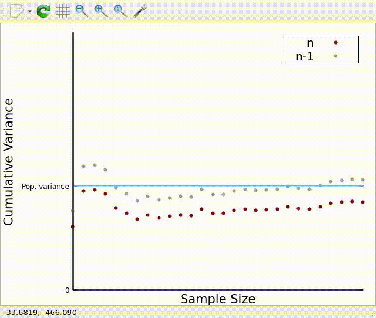

# C++ demonstration to show the intuition of sample variance

This program shows the difference between unbiased variance and biased variance. I got this idea from [Khan Academy](https://www.khanacademy.org/), as I was having a hard time understanding why we use (n-1) when getting the sample variance but (n) when getting the population variance. What this does is generate a random population with 200 elements that have values ranging from 0-200. Then it does random sampling with the given SAMPLE_SIZE*SAMPLES for each sampling, it calculates the cumulative variance mean and plots it. As the sample size grows for each sampling, the plot for (n-1) should be converging with the population variance, giving us a better approximation than the plot for (n).

### Sample variance(n-1):
### $\LARGE{\frac{\Sigma_{i=o}^{n} (x_i - \overline{x})^2}{n-1}}$

### Sample variance(n):
### $\LARGE{\frac{\Sigma_{i=o}^{n} (x_i - \overline{x})^2}{n}}$

## Demo


## Install
run `build.sh`
```bash
chmod +x ./build.sh
./build.sh

```
run `make`
```bash
cd build
make
```